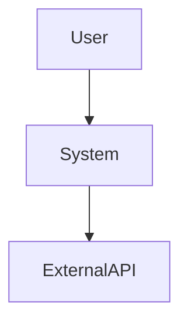
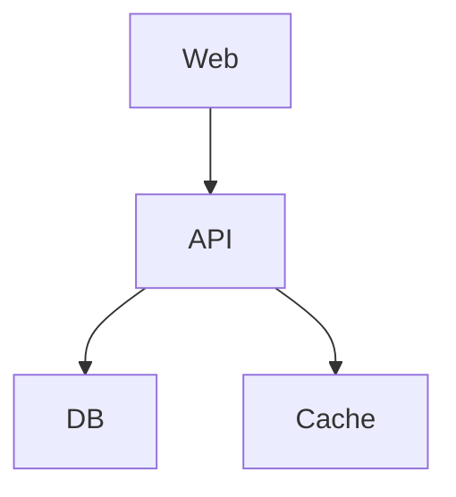
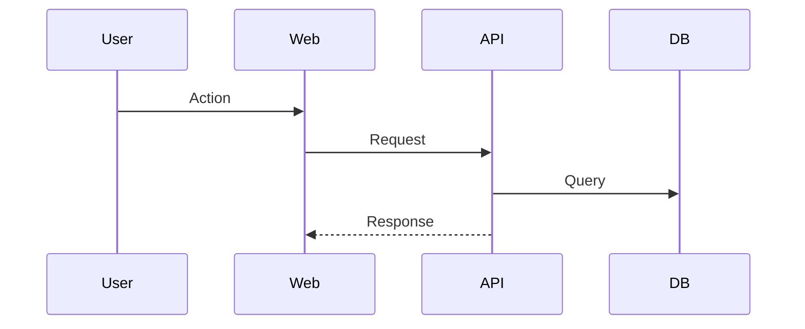

# Architecture

**Last Verified:** [Date]  
**Audience:** Engineers, architects  
**Scope:** System structure, data flow, design rationale

## When to use
- [Situations where this architecture is appropriate]

## When not to use
- [Constraints or contexts where this architecture is a poor fit]

## System Context

**Description:** System boundaries and external interactions.

## Container View

| Component | Technology | Responsibility | Scalability |
|---------|------------|----------------|-------------|
| Web | React | UI | Stateless |
| API | Node.js | Logic | Horizontal |
| DB | PostgreSQL | Persistence | Primary/Replica |

## Key Design Decisions

### [Decision Title]
**Context:** Why decision was needed  
**Decision:** What was chosen  
**Rationale:** Why  
**Consequences:** Trade-offs  
**Date:** When decided

## Data Flows

## Cross-Cutting Concerns
- Authentication
- Error handling
- Logging
- Monitoring

## Non-Goals
- Explicitly unsupported use cases or constraints

## Evidence Sources
- [ ] Code inspection
- [ ] Infrastructure config
- [ ] Assumptions

## Unknown / Unverified
- [ ] Architectural uncertainty
- [ ] Verification path
